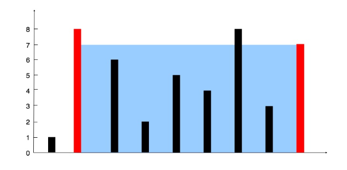

# Ejercicios Algoritmos Voraces.

## Repositorio.
Link: https://github.com/mgonzalz/eda2_algoritmos-voraces.git

Usuario: @mgonzalz

## Ejercicios
### Ejercicio 01: Recipientes.
Se le proporciona una matriz entera height de longitud n. Hay n líneas verticales dibujadas
de manera que los dos puntos finales de la i-ésima línea sean (i, 0) y (i, height[i]).
Encuentre dos líneas que junto con el eje x formen un recipiente, de modo que el recipiente
contenga la mayor cantidad de agua.

Devuelve la cantidad máxima de agua que un recipiente puede almacenar.

**Ejemplo 1:** 
Entrada -> height = [1, 8, 6, 2, 5, 4, 8, 3, 7] 
Salida -> 49 

**Ejemplo 2:** 
Entrada -> height = [1,1] 
Salida -> 1 

### Ejercicios 02: Caramelos.
Hay n niños haciendo fila. A cada niño se le asigna un valor de hambre dado en un array de
n enteros hunger.

Estás regalando caramelos a estos niños sujeto a los siguientes requisitos:
1. Cada niño debe tener al menos un caramelo.
2. Los niños con un valor de hambre más alto reciben más dulces que sus vecinos.
Devuelve la cantidad mínima de dulces que necesitas para distribuir los dulces a los niños.

**Ejemplo 1:** 
Entrada -> hunger = [1,0,2] 
Salida -> 5 
Explicación: Puede asignar al primer, segundo y tercer niño 2, 1 y 2 caramelos respectivamente. 
**Ejemplo 2:** 
Entrada -> hunger = [1,2,2] 
Salida -> 4 
Explicación: Puede asignar al primer, segundo y tercer niño 1, 2 y 1 caramelos respectivamente. 

### Ejercicio 03: Saltos.
Se te proporciona un array de números enteros nums. Inicialmente te ubicas en el primer
índice del array y cada elemento del array representa la longitud máxima de salto desde esa
posición.

Devuelve true si puedes llegar al último índice, o false en caso contrario.

**Ejemplo 1:** 
Entrada -> nums = [2,3,1,1,4] 
Salida -> true 
Explicación: Salta 1 paso del índice 0 al 1, luego 3 pasos hasta el último índice. 
**Ejemplo 2:** 
Entrada -> nums = [3,2,1,0,4] 
Salida -> false 
Explicación: Siempre llegarás al índice 3 pase lo que pase. Su longitud máxima de salto es 0, lo que imposibilita alcanzar el último índice.

### Ejercicio 04: Parejas.
Hay n parejas sentadas en 2n asientos dispuestos en fila y quieren darse la mano.

Las personas y los asientos están representados por un array de números enteros row
donde row[i] contiene el ID de la persona sentada en el asiento. Las parejas están
numeradas en orden, siendo la primera pareja (0,1), la segunda pareja (2,3), y así
sucesivamente hasta que la última pareja sea (2n - 2, 2n - 1)

Devuelve el número mínimo de intercambios para que cada pareja esté sentada una al lado
de la otra . Un intercambio consiste en elegir a dos personas cualesquiera, luego se
levantan y cambian de asiento.

**Ejemplo 1:** 
Entrada -> row = [0,2,1,3] 
Salida -> 1 
Explicación: Solo necesitamos intercambiar la segunda (row[1]) y la tercera (row[2]) persona. 
**Ejemplo 2:** 
Entrada -> row = [3,2,0,1] 
Salida -> 0 
Explicación: Todas las parejas ya están sentadas una al lado de la otra 
